# PLANLAMA VE YOL HARİTASI DÖKÜMANTASYONU (PLANLAMA.md)

Bu döküman, **Giresun İl Özel İdaresi**'nin **"Web Tabanlı Kent Bilgi Sistemi Kurulumu Projesi Hizmet Alımı"** (İhale Kayıt No: **2026/829981**) ihalesi kapsamında, 90 günlük yasal sürece ve ödeme planına uygun olarak hazırlanmış detaylı yazılım geliştirme ve uygulama planlama yol haritasıdır.

---

## 1. MEVCUT DURUM ANALİZİ VE TEKNOLOJİK GEÇİŞ

İnceleme sonucunda, idarede veya mevcut kod tabanında yer alan yapı ile ihale hedefleri karşılaştırılmış ve geçiş planı aşağıdaki gibi belirlenmiştir:

*   **Mevcut Mimari Durumu:**
    *   Arka uç: `.NET 10.0` (C#) Web API ve Entity Framework Core.
    *   Ön yüz: `React 19` ve `TypeScript` tabanlı Leaflet harita uygulaması.
    *   Veritabanı: `SQLite` (`mekanik_leaflet.db`), coğrafi veri tipleri bulunmamakta ve enlem/boylam `double` olarak tutulmaktadır.
*   **Hedeflenen Mimari Durumu:**
    *   Veritabanı SQLite'tan **PostgreSQL / PostGIS** ilişkisel ve konumsal veritabanına taşınacaktır.
    *   C# tarafında konumsal geometriler (Point, LineString, Polygon) için `NetTopologySuite` kütüphanesi EF Core'a entegre edilecektir (`Npgsql.EntityFrameworkCore.PostgreSQL.NetTopologySuite`).
    *   Harita verileri OGC standartlarında (WMS, WFS, Vector Tile) açık kaynaklı bir CBS sunucusu (örneğin **GeoServer**) üzerinden sunulacaktır.

---

## 2. 90 GÜNLÜK GELİŞTİRME VE TESLİMAT PLANI (YOL HARİTASI)

Projenin teslimat takvimi, teknik şartnamenin *11. Maddesinde* yer alan hakediş ödeme dönemleriyle tam uyumlu olacak şekilde 5 faza bölünmüştür:

```mermaid
gantt
    title Giresun KBS Geliştirme Yol Haritası (90 Gün)
    dateFormat  D
    axisFormat %d. Gün
    
    section Faz 1: Analiz & Veri Tabanı Tasarımı (T0 - T0+5)
    Gereksinim Analizi ve Akış Şemaları    :active, p1, 1, 5
    Veri Tabanı Şeması Tasarımı (PostGIS)  :active, p2, 3, 5
    
    section Faz 2: Altyapı & Çekirdek Kurulum (T0+6 - T0+15)
    PostgreSQL & GeoServer Kurulumu       :p3, 6, 10
    React CBS Portalı Kurulumu            :p4, 8, 13
    Çekirdek Modül İskeletleri (İmar, Ruhsat) :p5, 11, 15
    
    section Faz 3: Veri Taşıma & Entegrasyon (T0+16 - T0+45)
    Eski Verilerin Temizlenmesi & Göçü    :p6, 16, 25
    MEGSİS, TAKBİS ve MAKS Entegrasyonu   :p7, 26, 40
    CBS Servislerinin GeoServer'da Yayını :p8, 35, 45
    
    section Faz 4: İleri Modüller & E-İmza (T0+46 - T0+85)
    Taşıt Görev Emri Modülü               :p9, 46, 60
    Kaçak Yapı & Kudeb & Proje Modülleri  :p10, 55, 75
    E-İmza (CAdES, XAdES, PAdES) Entegrasyonu:p11, 65, 80
    3D Harita & Online Ödeme Sistemleri   :p12, 70, 85
    
    section Faz 5: Test, Eğitim & Kabul (T0+86 - T0+90)
    Performans, Güvenlik & UAT Testleri   :p13, 86, 88
    İdare Eğitimleri (5-10 Gün)           :p14, 87, 90
    Kesin Kabul ve Garanti Süreci         :p15, 89, 90
```

---

### FAZ 1: İŞ ANALİZİ VE VERİ TABANI TASARIMI (T0 - T0+5 GÜN)
*   **Amaç:** İdarenin ürettiği verilerin analizi, iş akış şemalarının hazırlanması ve ilişkisel PostGIS veritabanı modelinin tasarlanması.
*   **Ödeme Oranı:** %15
*   **Yapılacak İşler:**
    1.  İdarenin birimleriyle toplantıların yapılarak iş akışlarının (imar, ruhsat, evrak başvuru vb.) netleştirilmesi.
    2.  İlişkisel konumsal veritabanı şemasının (PostgreSQL/PostGIS) PostgreSQL standartlarına uygun olarak tasarlanması. Şifreler için SHA256 yapısının kurgulanması.
    3.  Tüm süreçlere ait iş akış şemalarının (Flowchart) çizilmesi ve İdareye teslim edilmesi.
*   **Teslim Edilecekler:** Analiz Raporu, Veri Tabanı Tasarım Şeması (ER Diyagramı), Onaylanmış İş Akış Şemaları.

### FAZ 2: CBS ALTYAPISI VE ÇEKİRDEK PORTAL KURULUMU (T0+6 - T0+15 GÜN)
*   **Amaç:** Sunucuların kurulması, Web CBS Portalı ve tüm modüllerin (E-İmar, E-Ruhsat, E-Başvuru, E-Arşiv, E-Taşınmaz, E-Proje, E-Kudeb) çekirdek yapılarının İdare sunucularında kurulması ve çalıştırılması.
*   **Ödeme Oranı:** %35
*   **Yapılacak İşler:**
    1.  İdarenin sunucusuna PostgreSQL, PostGIS uzantısı ve GeoServer kurulumlarının yapılması.
    2.  .NET 10.0 Web API projesinin PostgreSQL / NetTopologySuite bağlantılarının yapılandırılması.
    3.  React 19 / TypeScript ön yüz projesine Leaflet tabanlı CBS harita bileşeninin ve OGC katman desteğinin (WMS, WFS, Vector Tile) eklenmesi.
    4.  Tüm modüllerin (E-İmar, E-Ruhsat, E-Başvuru vb.) temel veritabanı tablolarının, API uç noktalarının ve arayüz iskeletlerinin oluşturularak kurulması.
*   **Teslim Edilecekler:** İdare Sunucusunda Çalışan Web CBS Portalı ve 8 Çekirdek Modülün İlk Çalışır Sürümleri.

### FAZ 3: VERİ ÇALIŞMALARI, MİGRASYON VE ENTEGRASYONLAR (T0+16 - T0+45 GÜN)
*   **Amaç:** İdarenin mevcut kadastro, imar planları, adres ve tapu verilerinin temizlenerek PostgreSQL veritabanına göç ettirilmesi, OGC servislerinin açılması ve dış servis entegrasyonlarının (MEGSİS, TAKBİS, MAKS) yapılması.
*   **Ödeme Oranı:** %10
*   **Yapılacak İşler:**
    1.  İdare'den alınan CAD (DGN, DWG) ve GIS (SHP, KML, GeoJSON) verilerinin incelenmesi ve topolojik hatalarının giderilmesi.
    2.  Verilerin PostgreSQL/PostGIS veritabanına taşınması ve coğrafi indekslerin (GIST) oluşturulması.
    3.  Göç ettirilen verilerin GeoServer üzerinden WMS/WFS/Vector Tile olarak yayına açılması.
    4.  TKGM (MEGSİS, TAKBİS) ve MAKS servis bağlantılarının entegrasyonu. Günlük konumsal veri güncellemelerinin arka plan işlerine bağlanması.
    5.  Numarataj karekod (QR Code) saha fotoğrafı yükleme özelliğinin geliştirilmesi.
*   **Teslim Edilecekler:** Göçü Tamamlanmış Canlı CBS Veritabanı, Aktif GeoServer Katmanları, TKGM/MAKS Entegrasyon Raporu.

### FAZ 4: İLERİ SEVIYE MODÜLLER VE E-İMZA ENTEGRASYONU (T0+46 - T0+85 GÜN)
*   **Amaç:** Taşıt Görev Emri, Kaçak Yapı, Kırsal Yapı Belgeleri modüllerinin yazılması, e-imza entegrasyonunun (CAdES, XAdES, PAdES) tamamlanması ve modüllerin birbirleriyle ilişkilerinin kurgulanması.
*   **Ödeme Oranı:** %35
*   **Yapılacak İşler:**
    1.  **Taşıt Görev Emri Modülü:** Araç ve şoför yönetimi, çoklu amir onay akışı, araç kapasite ve uygunluk kontrolü, GPS rota entegrasyonu, aylık icmal cetveli üretiminin yazılması.
    2.  **Kaçak Yapı Modülü:** İhbar, tespit, ceza ve yazışma şablonlarının otomatik oluşturulması, E-Ruhsat ile ilişki kurulması.
    3.  **E-İmza Entegrasyonu:** PAdES, CAdES, XAdES standartlarında sunucu taraflı imzalama ve doğrulama motorunun entegrasyonu. LTV ve zaman damgası desteği.
    4.  **E-Arşiv OCR Modülü:** Yüklenen PDF ve resimlerin otomatik OCR taranması ve veri tabanında indekslenmesi.
    5.  **Dinamik Ücret ve Online Ödeme:** Gelir servisi entegrasyonu, SMS/E-posta bildirim servisleri.
    6.  **3B Görünüm:** Haritanın sayfa yenilenmeden 2B/3B modlar arasında geçiş yapabilmesi.
*   **Teslim Edilecekler:** Taşıt Görev Emri ve Kaçak Yapı Modülleri, E-İmza Altyapısı Entegrasyonu, Canlı E-Arşiv OCR Sistemi, E-Ödeme Entegrasyonu.

### FAZ 5: TESTLER, EĞİTİM VE KESİN KABUL (T0+86 - T0+90 GÜN)
*   **Amaç:** Sistemin tüm güvenlik, yük ve kabul testlerinin yapılması, kullanıcı eğitimlerinin tamamlanması ve projenin kesin kabul edilerek teslim edilmesi.
*   **Ödeme Oranı:** %5
*   **Yapılacak İşler:**
    1.  Fonksiyonel ve yük testlerinin (JMeter/K6 vb.) yapılması.
    2.  Sızma (Penetrasyon) ve OWASP Top 10 güvenlik testlerinin gerçekleştirilmesi.
    3.  İdare bünyesinde belirlenen personele en az 5 (beş) iş günü sürecek detaylı kullanıcı, editör ve sistem yöneticisi eğitimlerinin verilmesi.
    4.  Eğitim videolarının ve kullanım kılavuzlarının idareye teslimi.
    5.  Kesin Kabul işlemlerinin tamamlanması ve 1 yıllık garanti sürecinin başlatılması.
*   **Teslim Edilecekler:** Test Raporları (UAT, Performans, Güvenlik), Eğitim Katılım Belgeleri ve Videoları, Kullanıcı Kılavuzları, Kaynak Kodlar.

---

## 3. RİSK YÖNETİMİ VE ÖNLEMLER

| Risk Tanımı | Etki Derecesi | Önlem ve Çözüm Planı |
| :--- | :---: | :--- |
| **Yedekleme kaynaklı veri kaybı ve %15 ceza riski** | **Çok Yüksek** | Kurulum ve güncellemeler öncesinde İdare'den yazılı onay alınacaktır. İdare sistem yöneticisinin yedekleme yaptığına dair sistem logları/ekran görüntüleri alınmadan hiçbir veritabanı veya sunucu müdahalesi yapılmayacaktır. |
| **MEGSİS/MAKS servislerinin yavaşlığı veya erişilemez olması** | **Yüksek** | Entegrasyonlar asenkron arka plan servisleri (Background Workers/Hangfire) üzerinden çalıştırılacak; servis kesintilerinde veri kuyruğa (queue) alınarak sistemin durması engellenecektir. |
| **Büyük boyutlu taranmış PDF evraklarında OCR işlem yükü** | **Orta** | OCR işlemi, web isteklerinin performansını düşürmemek adına asenkron bir kuyruk yapısı (Message Queue) üzerinden arka planda çalıştırılacaktır. |
| **İstemci tarafında e-imza kart sürücüsü uyumsuzlukları** | **Orta** | PKCS#11 standardı kullanılarak istemciden bağımsız, sunucu taraflı doğrulama altyapısı tercih edilecek, böylece istemci tarafındaki Java veya sürücü bağımlılıkları sıfıra indirilecektir. |
| **Eski verilerin kalitesiz veya hatalı olması (CAD/GIS uyumsuzlukları)** | **Yüksek** | Faz 3'ün başında kapsamlı bir veri analiz ve temizleme süreci yürütülecek, veri şemasına uymayan konumsal veriler için otomatik topoloji düzeltme scriptleri kullanılacaktır. |
